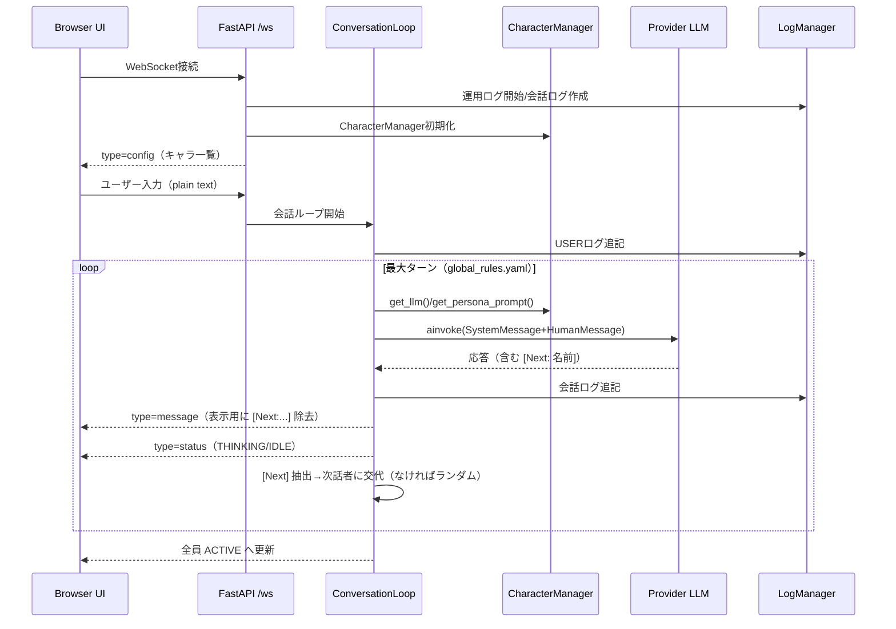

# システム全体概要（LlmMultiChat）

## 概要
- 本システムは複数キャラクター（LLM）による自律会話を WebSocket 経由で提供する、FastAPI ベースのローカル実行基盤。
- キャラクター定義・LLM接続・プロンプト（ペルソナ）・共通ルール・会話ログが分離設計。

## 技術スタック
- サーバ: FastAPI / Uvicorn
- クライアント: 素の HTML/CSS/JavaScript（`html/`）
- LLM接続: HTTPクライアント（Ollama REST / OpenAI API）、オーケストレーションは LangGraph
- モデルプロバイダ: 現実装では `ollama` / `openai` を `LLMFactory` がサポート
- 通信: WebSocket（JSON メッセージ: `config` / `message` / `status`）
- 設定: YAML（`LLM/config.yaml`, `LLM/personas.yaml`, `LLM/global_rules.yaml`）
- ログ: `LLM/logs/` に会話ログと運用ログを保存

## 主要モジュールと役割
- `LLM/main.py`: エントリーポイント。静的配信 `/static`、ルート `/` リダイレクト、WebSocket `/ws` を提供
- `LLM/websocket_manager.py`: WebSocket ハンドラの薄いラッパ。会話ループを起動
- `LLM/conversation_loop.py`: ユーザー入力受付→自律指名ループ（`[Next: ...]`）→メッセージ送信。`global_rules.yaml` 反映
- `LLM/character_manager.py`: `config.yaml`/`personas.yaml` を読み込み、LLM とペルソナを統合して提供
- `LLM/llm_factory.py`: プロバイダごとの LLM 生成（`ollama` / `openai`）
- `LLM/llm_instance_manager.py`: キャラごとの LLM インスタンスをキャッシュ
- `LLM/persona_manager.py`: 表示名（日本語）→システムプロンプト取得
- `LLM/status_manager.py`: クライアントへ `status` イベント送信（ACTIVE / IDLE / THINKING）
- `LLM/initial_status_setter.py`: 接続直後の全キャラステータスを ACTIVE に
- `LLM/log_manager.py`: 会話ログ/運用ログの生成・追記・要約整形

## 設定ファイル
- `LLM/config.yaml`: キャラ並び・表示名・プロバイダ・モデル・`base_url`（Ollama リモート対応）
- `LLM/personas.yaml`: キャラの人格・口調の「純粋なペルソナ」。会話フロー指示は含めない
- `LLM/global_rules.yaml`: 共有ルール（応答制約 / `[Next: ...]` 指名 / 自律ターン数 / プロンプトテンプレート）

## 実行フロー（概略）
1. ブラウザが `/` にアクセス → `/static/`（`html/`）配信
2. フロントが `ws://<host>/ws` で接続
3. サーバは会話ログ/運用ログを作成し、`config` を送信
4. ユーザーがテキスト送信 → ログ保存 → 1キャラ目から自律指名ループ開始（最大ターン）
5. 各ターン: ペルソナ＋共通ルール＋会話履歴を合成した `SystemMessage` を LLM に投げ、応答から `[Next: 名前]` を抽出。
6. 応答（`message`）とステータス（`status`）をフロントに送信。最後に全員 ACTIVE に戻し、次のユーザー入力を待機

## 会話フロー図（Mermaid）

## データ/ログ
- 会話ログ: `LLM/logs/conversation_YYYYMMDD-HHMMSS.log`
- 運用ログ: `LLM/logs/operation_YYYYMMDD-HHMMSS.log`
- 履歴整形: 直近最大50行を LLM 入力向けに再整形（`Character:` 形式）

## フロントエンド
- `html/index.html`, `style.css`, `app.js`
- `type=config` を受けて、日本語表示名→英語キー（DOM要素ID）のマッピングを構築
- `type=message` をチャットログに追加、`type=status` で状態バッジ更新

## ギャップ/留意点
- README には複数プロバイダ記載（Gemini/Anthropic/OpenRouter）があるが、`LLMFactory` 現実装は `ollama/openai` のみ
- `docs/ChatAIMemorySpec.md` のメモリ階層（Redis/DuckDB/VectorDB/LoRA）は未実装（現状はログベースの文脈参照）
- `config.yaml` の `base_url` はリモートOllama依存のため、ネットワーク疎通が前提

## 改善候補（提案）
- `LLMFactory` に他プロバイダの実装を追加（README と整合）
- `ChatAIMemorySpec` の段階的実装（短期: 履歴要約→中長期: VectorDB 連携）
- WebSocket メッセージのスキーマ型定義（TypeScript 化）と簡易テスト
